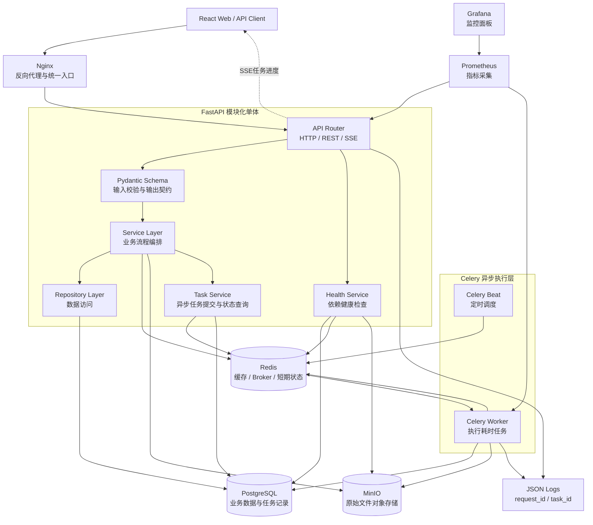
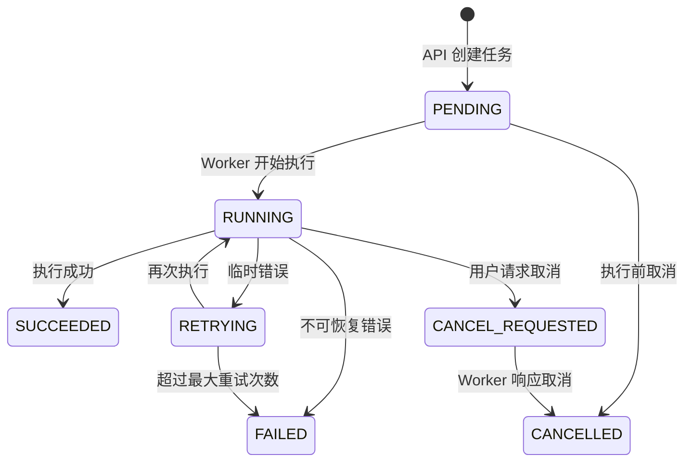
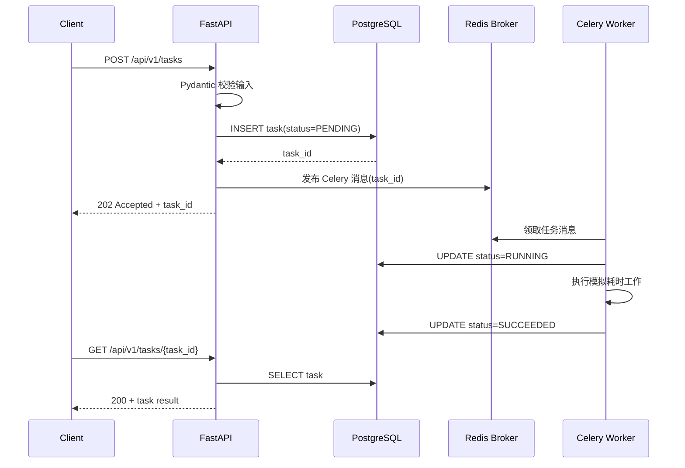

# MAPFTB 后端基础架构与学习清单

## 1. 后端架构图



## 2. 关键请求流程

### 普通请求

```text
Client -> Nginx -> FastAPI Router -> Pydantic 校验
       -> Service -> Repository -> PostgreSQL -> Response
```

### 耗时任务

```text
Client -> FastAPI 创建任务 -> PostgreSQL 保存任务
       -> Redis 队列 -> Celery Worker 执行
       -> 更新任务状态 -> Client 通过 SSE 获取进度
```

### 文件上传

```text
Client -> FastAPI 校验文件 -> MinIO 保存原始文件
       -> PostgreSQL 保存文件元数据与对象地址
       -> Celery Worker 异步解析
```

## 3. 先建立后端整体认识

### 3.1 后端到底负责什么

在 MAPFTB 中，后端不是简单地“给前端提供数据”。它承担四类职责：

1. **接收并校验请求**：确认用户提交的任务是否合法。
2. **保存可靠状态**：即使 API、Worker 或 Redis 重启，任务记录仍然存在。
3. **调度耗时工作**：把爬虫、文件解析、模型调用等任务交给后台 Worker。
4. **提供可观测结果**：让用户和开发者知道任务正在做什么、为什么失败。

一个典型调研任务可能持续数分钟甚至数小时。HTTP 请求不能一直等待，因此需要把“用户请求”和“实际执行”拆开。

```text
同步请求适合：查询车型、创建任务、读取任务状态
异步任务适合：爬取网站、处理视频、调用模型、生成 PPT
```

### 3.2 模块化单体是什么

第一版采用模块化单体：

```text
一个 FastAPI 应用
├── health 模块
├── task 模块
├── file 模块
└── future: vehicle / crawler / agent 模块
```

这些模块运行在同一个应用进程中，但代码边界清晰。它与“所有代码都写在一个文件里”不同，也与“每个模块都是独立服务”的微服务不同。

选择模块化单体的原因：

- 当前业务规则仍在快速变化，模块之间经常需要一起修改。
- 本地开发、测试和部署简单。
- 数据事务容易处理。
- 将来某个模块成为性能瓶颈时，可以再拆成独立服务。

不要为了展示架构能力过早拆微服务。微服务会额外引入服务发现、分布式事务、网络失败、接口兼容和部署编排等问题。

### 3.3 进程、线程、协程与 Worker

这是理解 FastAPI 和 Celery 的基础。

| 概念 | 简化理解 | 在本项目中的用途 |
|---|---|---|
| 进程 | 独立运行、拥有独立内存的程序实例 | API 进程、Celery Worker 进程 |
| 线程 | 同一进程内部的执行单元 | 执行阻塞型库或部分 Worker 任务 |
| 协程 | 单线程中主动让出执行权的轻量任务 | FastAPI 并发处理大量 I/O 请求 |
| Worker | 从队列领取并执行后台任务的执行者 | 执行爬虫、解析、AI 和 PPT 任务 |

异步 I/O 的核心不是“让单个任务运行更快”，而是：

> 当一个请求等待数据库或网络返回时，让事件循环处理其他请求。

如果在 `async def` 中直接执行耗时 CPU 运算或阻塞调用，事件循环仍然会被卡住。视频转码、模型推理等工作必须交给 Worker。

### 3.4 为什么需要三种存储

PostgreSQL、Redis 和 MinIO 解决的是不同问题。

| 存储 | 擅长解决的问题 | 不应该承担的问题 |
|---|---|---|
| PostgreSQL | 可靠业务数据、事务、关联查询 | 保存大量视频和图片二进制 |
| Redis | 快速缓存、队列、短期状态、原子计数 | 作为唯一可靠业务数据库 |
| MinIO | PDF、图片、视频、网页快照等大对象 | 复杂条件查询和事务关联 |

例如上传一个拆解视频：

```text
视频内容             -> MinIO
文件名、哈希、大小    -> PostgreSQL
解析任务消息          -> Redis
可靠任务状态          -> PostgreSQL
短期实时进度          -> Redis
```

### 3.5 什么叫“支持高并发”

高并发不是安装 Redis、Celery 和 Nginx 后自动获得的。它意味着系统在多个请求和任务同时到来时仍然：

- 不会重复执行不该重复的工作。
- 不会把数据库连接耗尽。
- 不会因为一个慢任务阻塞所有请求。
- 能够限制外部网站和模型 API 的调用速率。
- 能够观察吞吐量、延迟和失败率。

第一版需要证明的是并发设计合理，而不是宣称支持百万请求。

建议后续记录以下指标：

```text
API QPS
API P95 延迟
数据库连接池使用率
任务排队时间
Worker 执行时间
任务成功率与重试率
```

## 4. 完整任务生命周期

### 4.1 为什么 PostgreSQL 是任务状态的事实来源

Redis 中的数据可能因为过期、淘汰或重启而消失。Celery 的任务结果也更适合执行层查询，不适合作为业务事实。

因此系统自己维护 `tasks` 表：

```text
tasks
├── id
├── task_type
├── status
├── progress
├── input_json
├── result_json
├── error_code
├── error_message
├── retry_count
├── created_at
├── started_at
└── finished_at
```

第一版状态机：



状态转换必须由 Service 层控制，不能让任意代码直接修改。例如 `SUCCEEDED` 不能重新变为 `RUNNING`。

### 4.2 创建异步任务的详细时序



API 返回 `202 Accepted`，表示服务器已经接受请求，但工作尚未完成。

### 4.3 数据库写入成功，但消息发送失败怎么办

这是第一版最值得理解的问题：

```text
1. PostgreSQL 已创建 PENDING 任务
2. API 向 Redis 发布消息时失败
3. 用户拿到了任务 ID，但 Worker 永远收不到任务
```

明天可以使用简单策略：

- 发布失败时，将任务标记为 `FAILED`。
- 返回明确错误，允许用户重新提交。

长期更可靠的方案是 **Transactional Outbox**：

```text
同一个数据库事务中：
1. 写入 tasks
2. 写入 outbox_events

独立发布器持续读取 outbox_events，并向消息队列发送。
发送成功后，将事件标记为已发布。
```

这样可以保证“业务记录”和“待发送事件”要么一起成功，要么一起失败。

### 4.4 Worker 为什么可能重复执行任务

消息队列通常提供的是“至少投递一次”，不是“绝对只投递一次”。

例如：

```text
Worker 完成任务
-> 更新数据库成功
-> 还没向 Broker 确认消息
-> Worker 崩溃
-> Broker 将消息再次交给另一个 Worker
```

因此任务必须具备幂等性：

> 同一任务执行一次或多次，最终业务结果一致，不产生重复副作用。

第一版可使用：

- 任务开始前检查当前状态。
- `SUCCEEDED` 任务不重复执行。
- 使用数据库唯一约束防止重复记录。
- 状态更新时带上预期旧状态。

示意 SQL：

```sql
UPDATE tasks
SET status = 'RUNNING', started_at = now()
WHERE id = :task_id AND status IN ('PENDING', 'RETRYING');
```

如果受影响行数为 `0`，说明任务已被其他 Worker 领取或当前状态不允许执行。

### 4.5 临时错误与永久错误

并非所有失败都应该重试。

| 错误 | 是否重试 | 示例 |
|---|---|---|
| 临时网络超时 | 是 | 外部网站暂时无响应 |
| HTTP 429 | 是，但必须退避 | 外部接口限流 |
| 数据库短暂断连 | 是 | 网络抖动 |
| 用户输入非法 | 否 | 缺少必要参数 |
| 文件格式不支持 | 否 | 上传可执行文件 |
| 解析规则错误 | 通常否 | 代码无法解析页面结构 |

重试应采用指数退避并设置最大次数：

```text
第 1 次失败后等待 2 秒
第 2 次失败后等待 4 秒
第 3 次失败后等待 8 秒
超过上限后标记 FAILED
```

无限重试会造成队列拥堵和外部服务压力。

## 5. 分层代码结构与职责

推荐后端目录：

```text
backend/
├── app/
│   ├── main.py                  # 创建 FastAPI 应用
│   ├── api/
│   │   ├── router.py            # 汇总所有路由
│   │   └── v1/
│   │       ├── health.py
│   │       └── tasks.py
│   ├── core/
│   │   ├── config.py            # 环境变量与配置
│   │   ├── database.py          # Engine 与 Session
│   │   ├── logging.py
│   │   └── redis.py
│   ├── models/
│   │   └── task.py              # SQLAlchemy ORM Model
│   ├── schemas/
│   │   └── task.py              # Pydantic 输入输出 Schema
│   ├── repositories/
│   │   └── task.py              # 数据库读写
│   ├── services/
│   │   ├── health.py
│   │   └── task.py              # 状态转换与业务规则
│   └── workers/
│       ├── celery_app.py
│       └── tasks.py
├── migrations/
├── tests/
└── pyproject.toml
```

每层只处理自己的职责：

```text
Router:
  处理 HTTP 语义，读取参数，选择状态码

Schema:
  校验输入和约束输出格式

Service:
  编排业务流程，控制事务和状态转换

Repository:
  执行数据库查询，不决定业务规则

Model:
  描述数据库表结构

Worker:
  执行后台任务，复用 Service 与 Repository
```

不要把所有逻辑放进 Router：

```python
# 不推荐：路由同时做校验、数据库操作、状态判断和后台执行
@router.post("/tasks")
async def create_task(...):
    ...
```

应让路由保持很薄：

```python
@router.post("/tasks", status_code=202)
async def create_task(
    payload: TaskCreate,
    service: TaskService = Depends(get_task_service),
) -> TaskRead:
    return await service.create_and_dispatch(payload)
```

### 5.1 ORM Model 与 Pydantic Schema 的区别

ORM Model 描述数据库如何保存数据：

```python
class Task(Base):
    __tablename__ = "tasks"
    id: Mapped[UUID] = mapped_column(primary_key=True)
    status: Mapped[TaskStatus]
```

Pydantic Schema 描述 API 接受和返回什么：

```python
class TaskCreate(BaseModel):
    task_type: str
    duration_seconds: int = Field(ge=1, le=30)

class TaskRead(BaseModel):
    id: UUID
    status: TaskStatus
    progress: int
```

分离后，数据库新增内部字段时不会自动泄露给客户端，API 也可以使用与数据库不同的表现形式。

### 5.2 Service 为什么控制事务

一次业务操作可能修改多张表。如果每个 Repository 自己 `commit`，中途失败时就无法整体回滚。

```text
Service 开始事务
-> Repository 创建任务
-> Repository 写审计记录
-> 任一步失败
-> Service 统一 rollback
```

Repository 通常只执行 `flush`，由 Service 决定何时 `commit`。

## 6. 技术栈作用、知识点与面试问题

### FastAPI

**架构作用**

- 提供 REST API、OpenAPI 文档和 SSE 接口
- 管理依赖注入、请求校验、鉴权和异常响应
- 接收任务请求，但不在 HTTP 请求中执行耗时工作

**需要掌握**

- ASGI 与 WSGI 的区别
- `async def` 的适用场景
- 路由、依赖注入、中间件和异常处理
- Pydantic 请求与响应模型
- 应用生命周期与连接初始化
- REST 状态码、分页和 API 版本管理
- SSE 与 WebSocket 的区别

**面试官可能提问**

- FastAPI 为什么性能较高？
- `async def` 是否一定比普通函数快？
- 在异步接口中调用阻塞函数会发生什么？
- 如何统一处理异常并返回规范错误码？
- 为什么耗时任务不能直接在请求中执行？
- SSE 和 WebSocket 分别适合什么场景？

### Pydantic v2

**架构作用**

- 校验外部输入
- 定义 API 输出契约
- 后续约束 Agent 的结构化输出

**需要掌握**

- `BaseModel`、字段约束和自定义校验器
- 输入 Schema 与数据库 Model 分离
- 序列化、反序列化与 ORM 模式
- 可选字段、默认值和严格模式

**面试官可能提问**

- 为什么不能直接将 ORM Model 暴露给 API？
- Pydantic 校验失败后如何处理？
- 如何处理部分更新 PATCH 请求？

### PostgreSQL

**架构作用**

- 保存用户、文件、任务和未来的汽车结构化事实
- 提供事务、约束、索引与可靠持久化
- 后续通过 pgvector 支持向量检索

**需要掌握**

- 表、主键、外键、唯一约束和检查约束
- ACID、事务隔离级别与 MVCC
- B-tree 索引、联合索引和最左匹配
- `EXPLAIN ANALYZE`
- 乐观锁、悲观锁与行锁
- JSONB 的适用边界
- 连接池与慢查询

**面试官可能提问**

- 为什么选 PostgreSQL，而不是 MySQL 或 MongoDB？
- 索引为什么能提高查询速度，又有什么代价？
- 什么情况下索引会失效？
- 如何防止两个 Worker 同时领取同一任务？
- Redis 已经保存任务状态，为什么还要写 PostgreSQL？
- pgvector 与普通业务表如何协作？

### SQLAlchemy 2 与 Alembic

**架构作用**

- SQLAlchemy 管理数据库访问和事务
- Alembic 对数据库结构进行版本化迁移
- Repository 层隔离业务逻辑与数据访问细节

**需要掌握**

- Session 生命周期
- ORM、Core 与原生 SQL 的取舍
- 懒加载与 N+1 查询
- `commit`、`flush`、`rollback`
- 异步 Session
- Alembic migration 的升级与回滚

**面试官可能提问**

- `flush` 和 `commit` 有什么区别？
- 什么是 N+1 问题，如何解决？
- 为什么不能在每个 Repository 方法里自行提交事务？
- 数据库迁移在多实例部署中如何执行？

### Redis

**架构作用**

- Celery 初期消息 Broker
- 保存短期任务进度
- 缓存热点查询
- 后续实现限流、幂等键和分布式锁

**需要掌握**

- String、Hash、List、Set、Sorted Set
- TTL 与缓存淘汰策略
- Cache Aside
- 缓存穿透、击穿和雪崩
- Redis 持久化 RDB/AOF
- 原子操作与 Lua Script
- 分布式锁的限制

**面试官可能提问**

- Redis 为什么快？
- 缓存与数据库不一致如何处理？
- Redis 宕机后任务状态是否会丢失？
- 如何实现 API 限流？
- `SET NX EX` 实现的锁有什么问题？
- 哪些数据绝不能只保存在 Redis？

### Celery 与 Celery Beat

**架构作用**

- Worker 执行爬取、解析、AI 调用和 PPT 生成等耗时任务
- Beat 后续定期触发网站采集任务
- 通过队列隔离 API 请求与后台计算

**需要掌握**

- Broker、Worker、Task、Result Backend
- `acks_late`、重试、超时和死信思路
- 至少一次投递语义
- 幂等任务设计
- 队列隔离与并发数配置
- 定时任务重复执行风险

**面试官可能提问**

- Celery 如何保证任务不丢失？
- Worker 执行成功但确认前崩溃会怎样？
- 为什么任务必须是幂等的？
- 如何取消正在执行的任务？
- 如何避免定时任务被重复执行？
- CPU 密集和 I/O 密集任务如何配置 Worker？

### MinIO

**架构作用**

- 保存 PDF、网页快照、图片、视频和后续生成的 PPTX
- PostgreSQL 只保存对象键、哈希、来源与元数据
- 提供兼容 S3 的对象存储接口

**需要掌握**

- 对象存储与文件系统的区别
- Bucket、Object Key、Metadata
- Presigned URL
- 文件哈希去重
- 大文件分片上传
- 生命周期策略

**面试官可能提问**

- 为什么不将图片和视频直接放进 PostgreSQL？
- 如何避免相同文件重复保存？
- 如何安全地允许前端下载私有文件？
- MinIO 与 AWS S3 有什么关系？

### Nginx

**架构作用**

- 对外提供统一入口
- 反向代理 API，提供前端静态文件
- 处理基础限流、请求大小和超时配置

**需要掌握**

- 正向代理与反向代理
- TLS 终止
- 负载均衡
- 超时和请求体大小限制
- SSE 代理时的缓冲配置

**面试官可能提问**

- 为什么 FastAPI 前面还需要 Nginx？
- Nginx 如何实现负载均衡？
- 为什么 SSE 经过 Nginx 后可能不能实时显示？

### Docker Compose

**架构作用**

- 统一启动 API、Worker、PostgreSQL、Redis、MinIO 和监控服务
- 固化开发环境，降低环境差异

**需要掌握**

- Image、Container、Volume、Network
- Dockerfile 分层与构建缓存
- 健康检查和服务依赖
- 环境变量与 Secret
- 数据卷持久化

**面试官可能提问**

- Image 和 Container 有什么区别？
- 删除容器后数据库数据为什么仍然存在？
- `depends_on` 是否代表依赖服务已经可以使用？
- 如何缩小镜像体积？

### Prometheus、Grafana 与结构化日志

**架构作用**

- Prometheus 采集请求数、错误率、延迟和任务指标
- Grafana 展示系统运行状态
- JSON 日志通过 `request_id` 和 `task_id` 串联一次调用

**需要掌握**

- Counter、Gauge、Histogram
- P50、P95、P99 延迟
- RED 指标：Rate、Errors、Duration
- 日志、指标和链路追踪的区别
- 高基数标签问题

**面试官可能提问**

- 平均响应时间为什么不够？
- Counter 和 Gauge 有什么区别？
- 为什么不能把 `user_id` 直接作为 Prometheus 标签？
- 如何定位一个后台任务失败的原因？

### pytest、Locust 与 GitHub Actions

**架构作用**

- pytest 验证服务和数据行为
- Locust 验证并发下的吞吐量与延迟
- GitHub Actions 自动执行检查、测试和构建

**需要掌握**

- 单元测试、集成测试和端到端测试
- Fixture、Mock 和参数化测试
- 测试数据库隔离
- 吞吐量、并发数和响应时间
- CI 流水线与质量门禁

**面试官可能提问**

- Mock 太多会导致什么问题？
- 如何测试 Celery 任务？
- 如何避免测试之间互相污染？
- 并发用户数和 QPS 有什么区别？
- 压测结果中的瓶颈如何定位？

## 7. 高频面试问题参考答案

这些答案用于帮助理解，不建议逐字背诵。面试时应结合项目中的实际实现、测试和指标回答。

### FastAPI 与并发

**问题：FastAPI 为什么性能较高？**

参考回答：

> FastAPI 基于 ASGI，并通常运行在 Uvicorn 上。对于数据库查询、HTTP 请求等 I/O 密集场景，协程在等待 I/O 时可以让出执行权，使单个进程并发处理更多请求。性能并不是 FastAPI 框架名称带来的；如果接口内部执行阻塞代码、数据库连接池太小或 SQL 很慢，性能仍然会下降。

**问题：`async def` 是否一定比 `def` 快？**

参考回答：

> 不一定。`async def` 适合调用异步数据库、异步 HTTP 客户端等 I/O 操作。CPU 密集工作不会因为加上 async 变快，反而会阻塞事件循环。FastAPI 对普通 `def` 通常会放在线程池执行，而视频处理和模型推理等重任务应交给 Celery Worker。

**问题：为什么任务创建接口返回 202，而不是等待完成后返回 200？**

参考回答：

> 任务执行时间较长，HTTP 请求持续等待会占用连接，也容易受到代理超时影响。接口先可靠记录任务并提交给队列，然后返回 `202 Accepted` 和任务 ID，客户端通过查询或 SSE 获取后续状态。

**问题：SSE 和 WebSocket 如何选择？**

参考回答：

> SSE 是服务端到客户端的单向事件流，基于普通 HTTP，支持自动重连，适合推送任务进度。WebSocket 支持双向低延迟通信，适合实时协作或聊天。当前任务进度主要是单向推送，所以优先 SSE。

### PostgreSQL、事务与索引

**问题：为什么任务状态要写 PostgreSQL，Redis 中不是已经有了吗？**

参考回答：

> Redis 负责队列和短期高速状态，但可能因过期、淘汰或故障丢失数据。任务状态属于业务事实，需要支持审计和历史查询，因此 PostgreSQL 是事实来源。Redis 中的进度可以丢失并重建，PostgreSQL 中的最终状态不能随意丢失。

**问题：什么是事务？**

参考回答：

> 事务把一组数据库操作视为一个整体。要么全部提交，要么失败后全部回滚。例如创建任务和写入审计记录必须一起成功，不能只完成一半。事务还通过隔离机制控制并发操作之间如何互相可见。

**问题：什么是 MVCC？**

参考回答：

> PostgreSQL 通过多版本并发控制，让读取操作通常不必阻塞写入操作。更新数据时会产生新的行版本，不同事务根据自己的快照看到合适版本。它提高了并发能力，但旧版本需要由 vacuum 清理。

**问题：索引为什么能加速查询？**

参考回答：

> 索引使用额外数据结构，例如 B-tree，帮助数据库缩小需要扫描的数据范围，避免全表扫描。但索引占用空间，每次插入和更新也需要维护，所以不是越多越好。需要根据真实查询和 `EXPLAIN ANALYZE` 判断。

**问题：如何防止两个 Worker 同时执行同一任务？**

参考回答：

> 第一层依赖消息队列领取机制；业务层仍通过带状态条件的原子更新保护。例如仅允许把 `PENDING` 更新为 `RUNNING`，只有更新成功的 Worker 才能继续执行。复杂领取场景还可以使用 `SELECT ... FOR UPDATE SKIP LOCKED`。

### Redis 与缓存

**问题：Redis 为什么快？**

参考回答：

> Redis 主要在内存中操作，核心命令执行模型简单，并使用高效数据结构。它减少了磁盘随机 I/O，同时事件循环可以高效处理大量网络连接。但复杂命令、大对象和网络带宽仍可能造成性能问题。

**问题：什么是 Cache Aside？**

参考回答：

```text
读取：
1. 先查缓存
2. 缓存未命中则查数据库
3. 将结果写入缓存

更新：
1. 更新数据库
2. 删除缓存
```

> 删除缓存而不是直接更新缓存，可以减少并发更新时写入旧值的风险，但仍需要结合 TTL、重试或事件通知处理一致性问题。

**问题：缓存穿透、击穿和雪崩分别是什么？**

参考回答：

- 穿透：不断查询数据库中不存在的数据；可使用参数校验、空值缓存或 Bloom Filter。
- 击穿：某个热点 Key 过期，大量请求同时访问数据库；可使用互斥重建或逻辑过期。
- 雪崩：大量 Key 同时过期或 Redis 故障，导致数据库突然承压；可为 TTL 加随机值并设计降级策略。

**问题：Redis 分布式锁可靠吗？**

参考回答：

> `SET key value NX EX` 可以解决简单互斥问题，但需要唯一锁值并通过 Lua 脚本安全释放。任务超过锁 TTL、Redis 故障切换和网络分区都可能破坏互斥，因此不能仅靠锁保证业务正确性，还需要数据库约束和幂等设计。

### Celery 与任务可靠性

**问题：Celery 如何保证任务不丢失？**

参考回答：

> Celery 的可靠性来自 Broker 持久化、Worker 确认机制、重试和业务状态记录。可以使用 `acks_late` 让任务执行后再确认，但这会带来重复执行风险，所以任务必须幂等。对于业务关键任务，还应使用 PostgreSQL 记录可靠状态，并通过扫描修复长时间停留在异常状态的任务。

**问题：如何设计幂等任务？**

参考回答：

> 每个业务任务使用稳定任务 ID；执行前原子检查和转换状态；写入结果时使用唯一约束或 upsert；对外部副作用保存执行记录。这样同一消息被重复消费时不会重复创建业务结果。

**问题：如何设置 Worker 并发数？**

参考回答：

> 需要根据任务类型和资源测量。I/O 密集任务可以拥有较高并发，CPU 密集任务通常接近 CPU 核数，内存密集或模型任务还要考虑单任务内存。不同任务类型应进入不同队列并使用不同 Worker 配置，避免长任务拖慢短任务。

### MinIO 与文件存储

**问题：为什么视频不直接保存在 PostgreSQL？**

参考回答：

> 大对象会迅速增加数据库体积、备份时间和复制压力。MinIO 更适合大文件的上传、下载、分片和生命周期管理；PostgreSQL 保存对象键、哈希、来源、状态和权限等可查询元数据。

**问题：如何避免重复文件？**

参考回答：

> 上传时流式计算 SHA-256，数据库对内容哈希建立唯一约束。相同内容可以复用同一个对象，只新增业务引用。不能只依赖文件名，因为同名文件内容可能不同。

### 监控与压测

**问题：为什么平均响应时间不够？**

参考回答：

> 平均值会掩盖长尾延迟。例如大多数请求很快，但少量请求耗时数秒，平均值可能仍然正常。P95 表示 95% 请求在该时间内完成，更能反映用户体验和系统尾部问题。

**问题：如何定位压测瓶颈？**

参考回答：

> 先观察吞吐量、错误率和 P95，再依次检查 API CPU 与内存、事件循环阻塞、数据库慢查询与连接池、Redis 延迟、Worker 队列长度和外部依赖。一次只修改一个变量，并对比优化前后指标。

## 8. 明天的学习顺序

不要尝试在上班间隙一次性理解全部技术。先掌握支撑明天纵向链路的核心概念。

### 第一轮：建立整体认识，约 45 分钟

阅读本文第 1 至第 5 节，能够不看文档回答：

1. 为什么耗时任务不能直接在 FastAPI 请求中执行？
2. PostgreSQL、Redis 和 MinIO 分别保存什么？
3. 为什么 Worker 可能重复执行同一任务？
4. 什么叫幂等？
5. 为什么任务状态必须有状态机？

### 第二轮：重点学习数据库与任务队列，约 90 分钟

重点理解：

- 数据库事务、`commit`、`flush`、`rollback`
- PostgreSQL 为什么是任务事实来源
- Redis Broker 如何连接 API 与 Worker
- Celery 消息确认、重试和幂等
- `PENDING -> RUNNING -> SUCCEEDED/FAILED` 状态转换

学习完成后，尝试自己画出创建任务时序图。

### 第三轮：学习 FastAPI 分层，约 60 分钟

重点理解：

- Router、Schema、Service、Repository、Model 的职责
- `async def` 适合什么，不适合什么
- 依赖注入如何提供数据库 Session 和 Service
- 为什么返回 `202 Accepted`
- OpenAPI 如何帮助测试接口

### 第四轮：快速了解外围组件，约 45 分钟

只需要理解基本用途：

- Docker Compose 如何启动依赖
- MinIO 为什么保存大文件
- Prometheus 指标和 JSON 日志分别解决什么问题
- Nginx 为什么放在 API 前面

这些组件明天不要求全部做深。

## 9. 明天的开发范围

明天不实现完整生产架构，只完成可运行的基础纵向切片。

### 必须完成

1. 建立后端项目结构与配置管理。
2. 使用 Docker Compose 启动 PostgreSQL、Redis 和 MinIO。
3. FastAPI 提供 `/api/v1/health/live`。
4. FastAPI 提供 `/api/v1/health/ready`，检查三项外部依赖。
5. 使用 SQLAlchemy 与 Alembic 创建 `tasks` 表。
6. 提供创建任务和查询任务接口。
7. Celery Worker 执行模拟耗时任务，并更新任务状态。
8. 为健康检查和任务接口编写集成测试。
9. README 写清启动、迁移与测试命令。

### 有余力再完成

1. SSE 实时任务进度。
2. Prometheus `/metrics`。
3. Locust 基础压测脚本。
4. Nginx 统一入口。

### 暂不实现

- 用户系统
- Celery Beat
- Grafana 面板
- pgvector
- 文件解析
- 爬虫、Agent、多模态与 PPT

## 10. 明天按步骤开发

以下时间只是建议顺序，不是硬性工期。每一步都应先验证成功，再进入下一步。

### 步骤 1：创建项目骨架

产出：

- `backend/app` 分层目录
- `pyproject.toml`
- `.env.example`
- 最小 FastAPI 应用

验证：

```text
启动 API 后访问 /docs，能够看到 OpenAPI 页面。
访问 /api/v1/health/live，返回 200。
```

此时 `live` 只证明 API 进程仍在运行，不检查外部依赖。

### 步骤 2：启动基础依赖

使用 Docker Compose 启动：

- PostgreSQL
- Redis
- MinIO

需要理解：

- 服务之间通过 Compose 网络使用服务名连接。
- 本机访问服务时使用映射端口。
- Volume 保证容器重建后数据仍然存在。
- `depends_on` 只控制启动顺序，不能完全代表服务已经可用。

验证：

```text
docker compose ps 显示三个服务健康。
停止并重新创建容器后，数据库数据卷仍然存在。
```

### 步骤 3：连接 PostgreSQL 与创建迁移

产出：

- SQLAlchemy Engine 和 Session
- `tasks` ORM Model
- 第一条 Alembic migration

需要理解：

- Engine 管理数据库连接池。
- Session 表示一次工作单元，不等同于永久数据库连接。
- Migration 是数据库结构的版本历史。

验证：

```text
空数据库执行 alembic upgrade head 后出现 tasks 表。
执行 alembic downgrade 后能够按预期回退。
```

### 步骤 4：实现任务 CRUD

最低接口：

```http
POST /api/v1/tasks
GET  /api/v1/tasks/{task_id}
GET  /api/v1/tasks
```

创建任务请求示例：

```json
{
  "task_type": "demo_sleep",
  "duration_seconds": 5,
  "should_fail": false
}
```

响应示例：

```json
{
  "id": "7c0f...",
  "task_type": "demo_sleep",
  "status": "PENDING",
  "progress": 0,
  "created_at": "2026-06-10T09:00:00Z"
}
```

验证：

- 非法持续时间返回 `422`。
- 不存在的任务返回 `404`。
- 创建任务返回 `202`。
- 数据库可以查询到任务记录。

### 步骤 5：接入 Redis 与 Celery Worker

Celery 消息中只传递 `task_id`，不要传递完整 ORM 对象：

```text
消息小、可序列化；
Worker 根据 task_id 读取最新业务数据；
避免消息中的旧数据成为事实来源。
```

Worker 执行逻辑：

```text
读取任务
-> 原子转换为 RUNNING
-> 每秒更新进度
-> 成功则写 SUCCEEDED
-> 失败则按类型重试或写 FAILED
```

验证：

- API 和 Worker 分开运行。
- 停止 Worker 时仍能创建任务，任务保持 `PENDING`。
- 启动 Worker 后可以继续执行排队任务。
- 设置 `should_fail=true` 后能观察重试或失败状态。

### 步骤 6：实现 Readiness 检查

两个健康检查必须区分：

```text
/health/live:
  API 进程是否活着

/health/ready:
  API 是否具备正常提供服务的外部条件
```

`ready` 至少检查 PostgreSQL、Redis 和 MinIO，并返回每项结果。某项失败时整体返回 `503 Service Unavailable`。

验证：

- 正常情况下返回 `200`。
- 停止 Redis 后返回 `503`，并明确指出 Redis 不可用。
- Redis 恢复后无需重启 API 即恢复 `200`。

### 步骤 7：编写集成测试

至少覆盖：

```text
live 接口成功
ready 接口成功
创建任务成功
非法输入失败
查询存在任务成功
查询不存在任务返回 404
任务状态转换符合规则
```

测试不只是为了覆盖率，而是固定业务契约，防止后续增加汽车采集逻辑时破坏基础任务系统。

### 步骤 8：记录结果

README 至少记录：

- 架构简图
- 安装和启动命令
- 数据库迁移命令
- 测试命令
- 创建任务演示
- 当前已知限制

同时记录你真正遇到的一个问题和解决过程。这比只记录“项目成功启动”更适合作为面试材料。

## 11. 明天的验收标准

```text
docker compose up 能启动所有基础依赖
数据库迁移能够从空库成功执行
ready 接口能识别依赖正常与异常
创建任务后，Worker 能异步执行并更新状态
重复查询能够看到 PENDING -> RUNNING -> SUCCEEDED
Worker 失败后任务能够进入 FAILED 或按规则重试
核心集成测试能够通过
```

建议最终演示流程：

```bash
docker compose up -d
alembic upgrade head
uvicorn app.main:app --reload
celery -A app.workers.celery_app worker --loglevel=info
pytest
```

然后通过 OpenAPI 页面创建模拟调研任务，并观察任务状态变化。

## 12. 常见故障排查

### API 可以启动，但连接不上 PostgreSQL

检查顺序：

1. PostgreSQL 容器是否健康。
2. API 在宿主机运行还是 Compose 网络中运行。
3. 宿主机连接使用 `localhost:映射端口`。
4. 容器内连接使用 `postgres:容器端口`。
5. 用户名、密码和数据库名是否一致。

### 任务一直处于 PENDING

检查顺序：

1. Celery Worker 是否启动。
2. Worker 与 API 是否连接同一个 Redis。
3. Task 是否被正确注册。
4. 队列名称是否一致。
5. Worker 日志中是否出现反序列化或导入错误。

### Worker 执行了任务，但数据库状态没有变化

检查顺序：

1. Worker 是否连接正确数据库。
2. Session 是否执行 `commit`。
3. 异常是否被捕获后静默忽略。
4. 状态条件更新是否受影响行数为零。
5. 数据库事务是否被回滚。

### 异步接口仍然很慢

检查顺序：

1. 是否在 `async def` 中调用了同步阻塞库。
2. SQL 是否存在慢查询或 N+1。
3. 数据库连接池是否耗尽。
4. 是否错误地在 API 中执行了后台任务。
5. 外部依赖是否超时且未设置合理 timeout。

## 13. 面试时需要讲清楚的架构取舍

- 当前采用模块化单体，因为领域仍在探索，过早微服务化会增加复杂度。
- API 与 Worker 分离，避免爬虫、AI 和视频处理占用请求线程。
- PostgreSQL 保存可靠状态，Redis 仅承担缓存、Broker 和短期状态。
- MinIO 保存大型原始材料，数据库保存结构化元数据。
- Celery 是初期务实选择；未来出现大量事件流和多消费者后再评估 Kafka。
- 当前目标是通过压测证明设计行为，而不是宣称已经实现互联网级高并发。
