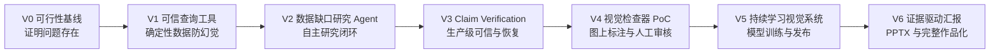

# MAPFTB 从最小成果到完整系统的交付路线

## 1. 路线原则

每个版本都必须：

1. 产生可运行的端到端成果，而不是只搭基础设施。
2. 对应真实 AI 应用开发 JD 能力。
3. 能回答明确的面试问题。
4. 有自动测试、指标和验收证据。
5. 不依赖尚未验证的高风险视觉能力才能成立。

完整愿景保持不变，但按风险与依赖顺序逐步交付。

## 2. 版本总览



一级求职版本截止到 `V3`。二级视觉扩展从 `V4` 开始。

## 3. V0：可行性基线

### 目标

证明通用模型确实无法可靠完成底盘研究，并建立后续评测基准。

### 功能

- 定义 10 个真实底盘研究问题。
- 人工完成 Golden Answer、候选车型、证据和未知项。
- 使用一个通用 Deep Research/LLM 完成相同任务。
- 对比事实正确率、证据覆盖率、深层工程特征覆盖率和耗时。

### 输出

- `evals/golden_tasks.jsonl`
- 基线评测脚本与报告。
- 第一版 Claim 类型定义。
- 风险与可行性结论。

### 验收

- 至少 10 个问题具有人工确认的标准答案。
- 能量化说明通用模型失败在哪里。
- 如果通用模型已满足需求，应停止或重新定位项目。

### 对应面试问题

- 为什么要开发这个 Agent？
- 你如何定义和评测复杂 AI 任务？

## 4. V1：可信结构化查询与计算工具

### 目标

建立最小端到端工具，证明 LLM 不负责生成确定性数据。

### 用户成果

输入一个竞品筛选和数值分析问题，系统输出带来源的车型集合、结构化数据和代码计算结果。

### 功能

- FastAPI 创建和查询研究任务。
- PostgreSQL 保存车型、版本、事实、来源和任务状态。
- 一个公开结构化数据适配器。
- 一个 Python 计算工具。
- 数字、单位、来源和版本校验。
- React 最小任务页和结果页。
- Docker Compose 一键启动。

### 必须演示

```text
输入筛选条件
→ 查询结构化车型数据
→ Python 计算差值或比例
→ 输出数值、来源、版本和计算过程
→ 修改输入后自动重新计算
```

### 验收指标

- 结构化测试数据查询正确率 100%。
- 已覆盖计算规则的数值 Claim 验证正确率 100%。
- 无来源数值不得进入最终结果。
- 核心 API 具有自动测试。

### 对应 JD

- Python、FastAPI、SQL、REST API、数据处理、工程化。

### 对应面试问题

- 如何避免 LLM 数值幻觉？
- 为什么使用工具而不是让模型直接回答？
- 如何处理单位和车型版本？

## 5. V2：数据缺口驱动的研究 Agent

### 目标

实现真正有 Agent 特征的自主研究闭环。

### 用户成果

输入“大型纯电 MPV 后悬架方案研究”，Agent 自动发现候选、建立 Checklist、识别粗粒度信息不足并继续搜索。

### 功能

- LangGraph Research State。
- Define Scope、Discover Vehicles、Build Checklist。
- Query Existing Facts、Identify Gaps、Select Tools、Update Checklist。
- 结构化查询、网页搜索、RAG 和 Python 计算工具。
- 最大步骤、时间、Token 和费用预算。
- 明确停止条件和未解决项。
- 前端展示 Checklist、当前节点和工具调用。

### 必须演示

```text
汽车之家返回“多连杆”
→ Agent 判断不能回答“H臂”
→ 创建 deep_suspension_architecture 缺口
→ 选择新数据源继续搜索
→ 达到预算后输出 supported/unknown，而非编造
```

### 验收指标

- Golden Tasks 中候选车型召回率达到预设基线。
- 数据缺口识别准确率可量化。
- 工具选择准确率可量化。
- 所有停止均有明确 stop_reason。

### 对应 JD

- Agent、LangGraph、Tool Calling、Workflow、上下文管理。

### 对应面试问题

- 为什么这不是固定 Workflow？
- Agent 如何判断下一步做什么？
- 如何避免无限循环和成本失控？

## 6. V3：Claim Verification 与生产可靠性

### 目标

形成一级求职版本。证明 Agent 的结论可信、过程可恢复、效果可评测。

### 用户成果

研究结果中的每条 Claim 都可展开查看验证过程、来源、版本、冲突、计算和限制。

### 功能

- Claim 类型系统和状态机。
- structured/computed/textual/inference/recommendation 验证路径。
- 来源、版本、时效、单位和跨来源冲突检查。
- 可解释质量评分。
- Human-in-the-loop 审核。
- LangGraph Checkpoint 与节点恢复。
- Celery 异步工具任务、幂等和重试。
- Langfuse/OpenTelemetry Trace。
- Token、费用、延迟、每条 Verified Claim 成本。
- RAG 和 Agent 自动评测。

### 必须演示

1. 故意让 Agent 生成错误比例，验证器通过代码演算拒绝。
2. 两个来源属于不同车型版本，系统识别为版本冲突。
3. 工具调用失败，任务从 Checkpoint 恢复。
4. 高风险工程推断进入人工审核。
5. 展示一次完整 Trace 与优化前后评测。

### 验收指标

- 数值、单位和无来源错误发现率达到预设门槛。
- 高置信错误率有明确统计。
- 失败恢复成功率有自动化测试。
- 每个模型节点均记录 Token、费用与延迟。
- Golden Dataset 可重复运行。

### 对应 JD

- 生产级 Agent、AI 评测、日志监控、稳定性、性能、成本治理。

### 对应面试问题

- 什么是生产级 Agent？
- 如何处理幻觉、冲突、失败和重试？
- 如何证明优化有效？
- Worker 重复执行如何保证幂等？

## 7. V4：底盘视觉检查器 PoC

### 目标

验证视觉方向是否值得继续投入，不要求自动化替代人工。

### 功能

- 图片来源、车型归属和版本不确定性记录。
- Grounding DINO/SAM/VLM 候选标注。
- CVAT 或 Label Studio 人工审核。
- 后车轮、轮心、后转向器、H 臂候选四类标注。
- 图上框、关键点、方向和关系显示。
- 审核后的视觉事实提交给 Claim Verification。

### 必须演示

```text
Agent 创建“判断转向器位置”视觉缺口
→ 自动生成候选标注
→ 工程师在图上修正
→ 系统执行空间关系计算
→ 生成 human_verified 视觉 Claim
→ 一级 Agent 从 Checkpoint 继续
```

### 验收指标

- 至少 50 张人工审核图片。
- 自动标注相对纯人工标注节省时间。
- 高置信视觉错误率可统计。
- 前置/后置判断对已确认样本可重复。

### 决策门

- 如果自动标注不能显著减少人工时间，停止训练专用模型。
- 如果公开图片无法支持可靠版本归属，将视觉结论限定为车系级。

## 8. V5：持续学习视觉系统

### 目标

将人工审核结果转化为可持续改进的专用视觉能力。

### 功能

- 主动学习样本优先级。
- DVC 数据集版本。
- YOLO 检测/分割/关键点训练。
- MLflow 实验和模型注册。
- 关键类别回归评测、发布门槛与回滚。
- 推理记录绑定模型版本。

### 验收指标

- 至少完成一次“审核 -> 数据集版本 -> 训练 -> 评测 -> 发布/拒绝”闭环。
- 候选模型不能损害关键类别指标。
- 所有视觉事实可追溯到模型和数据版本。

### 对应 JD

- 多模态、模型训练与部署、Human-in-the-loop、主动学习、模型治理。

## 9. V6：证据驱动研究汇报

### 目标

将稳定的研究结果转化为可编辑汇报，而不是让 PPT 生成反向主导系统设计。

### 功能

- 受众、目标和汇报时长。
- Claim 到 Slide 的确定性映射。
- 图表数据来自已验证事实。
- 每页保留来源和限制说明。
- Reviewer 检查无来源结论和数字一致性。
- python-pptx 导出。

### 验收指标

- PPTX 可打开和编辑。
- 图表数据与 Verified Facts 一致。
- 无来源结论数量为零或显式标注。
- 人工修改率可统计。

## 10. 推荐实施节奏

| 阶段 | 建议时间 | 结果 |
|---|---:|---|
| V0 | 2-3 天 | 是否值得开发的证据 |
| V1 | 5-7 天 | 可信结构化查询最小产品 |
| V2 | 7-10 天 | 数据缺口驱动 Agent |
| V3 | 10-14 天 | 一级求职版本 |
| V4 | 7-14 天 | 视觉可行性结论 |
| V5 | 1-2 个月 | 专用视觉持续学习 |
| V6 | 1-2 周 | 证据驱动汇报 |

时间是风险估算，不是承诺。任何版本未通过验收，不进入下一版本。

## 11. 每版本必备开发文档

| 文档 | V0 | V1 | V2 | V3 | V4+ |
|---|---:|---:|---:|---:|---:|
| 产品范围与非目标 | ✓ | 更新 | 更新 | 更新 | 更新 |
| Golden Dataset 说明 | ✓ | 更新 | 更新 | 更新 | 更新 |
| 系统蓝图 |  | ✓ | 更新 | 更新 | 更新 |
| API 契约 |  | ✓ | 更新 | 更新 | 更新 |
| 数据字典/ERD |  | ✓ | 更新 | 更新 | 更新 |
| Agent 节点契约 |  |  | ✓ | 更新 | 更新 |
| Tool Schema 与错误分类 |  |  | ✓ | 更新 | 更新 |
| Claim 类型与验证规则 |  | 基础 | 基础 | ✓ | 更新 |
| ADR 技术决策记录 |  | ✓ | 更新 | 更新 | 更新 |
| 测试计划与覆盖报告 | ✓ | ✓ | ✓ | ✓ | ✓ |
| 评测报告 | ✓ | ✓ | ✓ | ✓ | ✓ |
| Trace/成本分析 |  |  | 基础 | ✓ | ✓ |
| 运行手册与故障复盘 |  | 基础 | ✓ | ✓ | ✓ |
| 模型卡/数据集卡 |  |  |  |  | ✓ |

## 12. 开发门禁

任何功能进入主分支前必须回答：

1. 它对应哪个用户问题和 JD 能力？
2. 它的输入、输出和错误状态是否明确？
3. 是否已有开源项目可复用？
4. 是否有自动测试或评测样本？
5. 是否记录来源、版本、Trace 和成本？
6. 失败后如何恢复或降级？
7. 它是否扩大了未经验证的高风险范围？

不能回答的问题，不进入当前版本。

## 13. 一级版本 Definition of Done

`V3` 完成时必须具备：

- 一个真实研究问题可以端到端运行。
- Agent 自主建立 Checklist、识别数据缺口并选择工具。
- 结构化事实和数值计算不由 LLM 编造。
- 每条最终 Claim 均有验证状态、来源和限制。
- 至少演示一次冲突治理、人工审核和失败恢复。
- Golden Dataset、自动评测和指标报告可重复运行。
- FastAPI、数据库、Worker、Trace 和前端均可通过 Docker Compose 启动。
- README 包含架构、演示、指标、已知限制和开源依赖说明。

