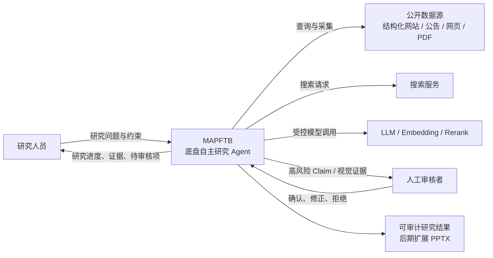
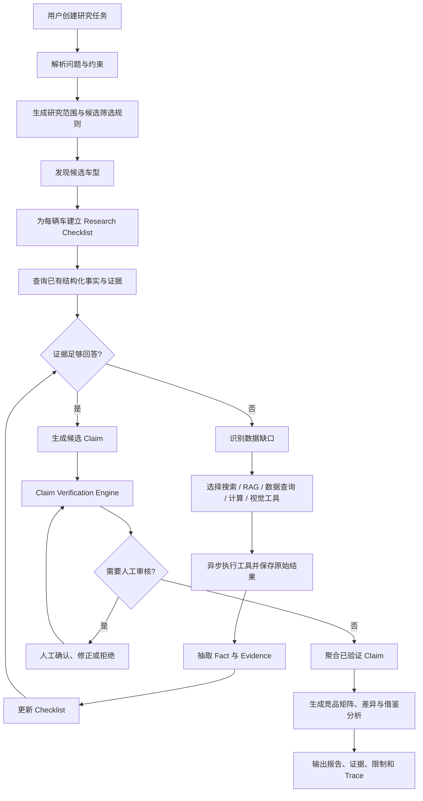
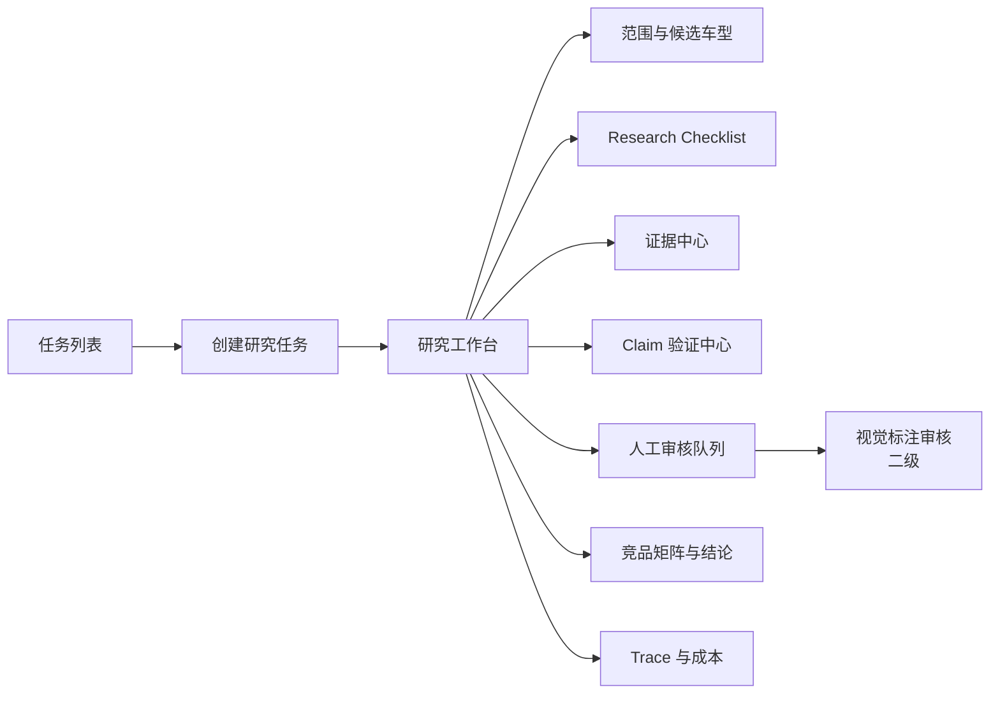
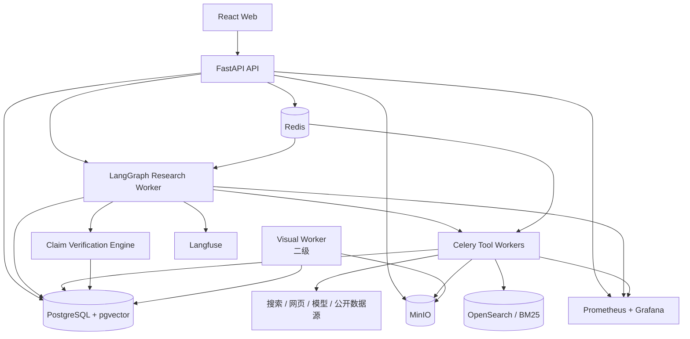
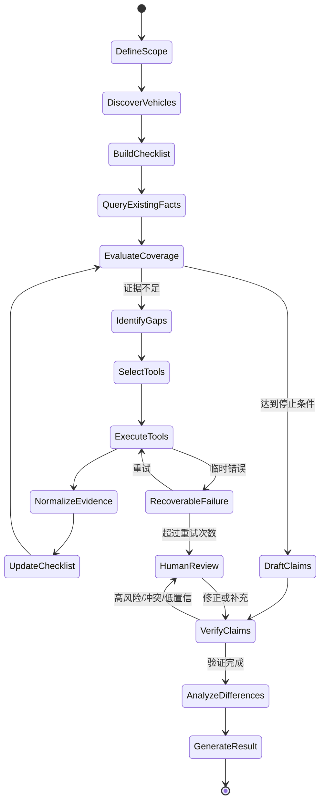
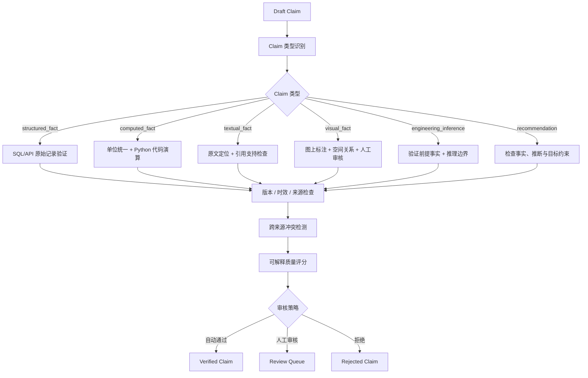
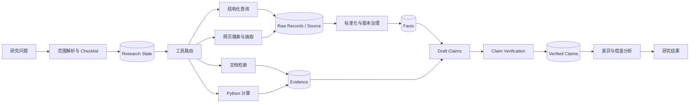
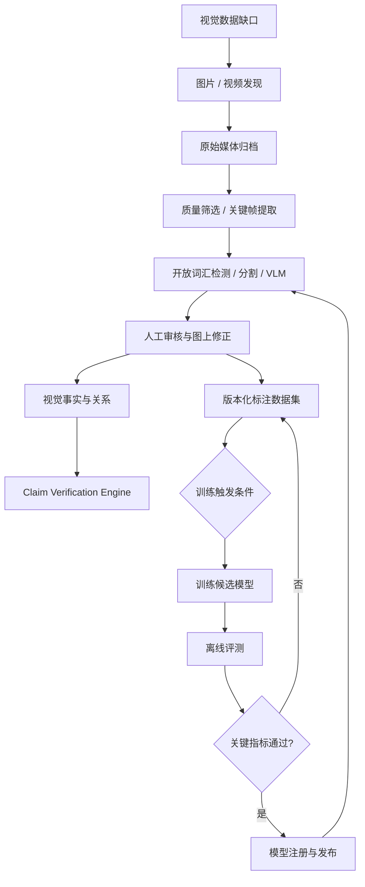
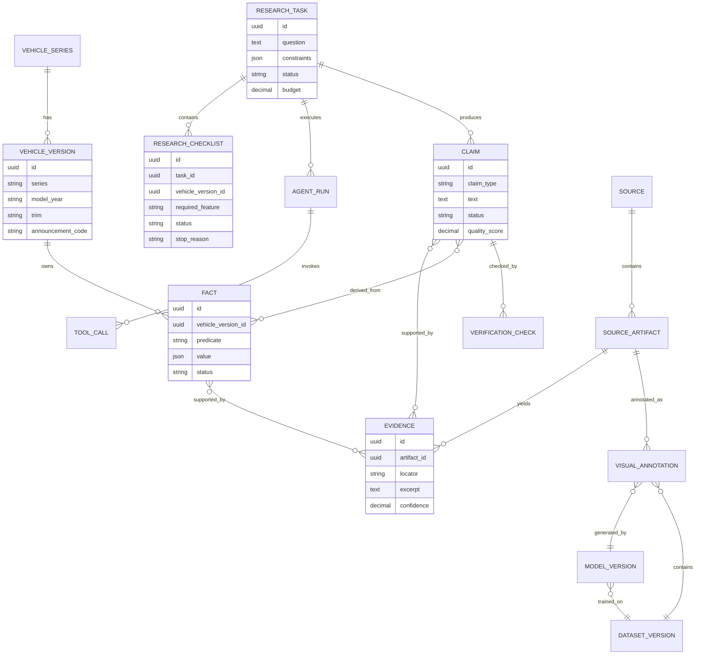
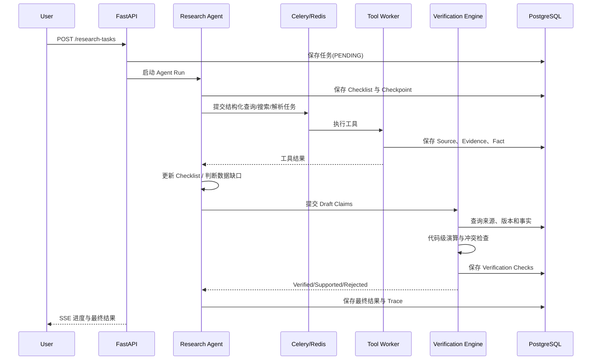

# MAPFTB 产品与系统蓝图

## 1. 文档目的

本文定义 MAPFTB 从输入到输出的产品流程、模块边界、数据流、核心数据模型、页面原型、开源复用方案与自研范围。它是产品设计、技术实现、测试验收和面试讲解的共同基准。

MAPFTB 当前定位：

> 基于公开数据的个人汽车底盘自主研究工具。系统根据研究问题建立 Research Checklist，自主查询和收集证据，识别数据缺口，对 AI 生成的 Claim 执行来源、版本、单位和代码级验证，并输出可审计的竞品研究结果。

当前不宣称：

- 代替底盘工程师完成所有研究。
- 使用或代表任何公司的内部数据与正式系统。
- 自动视觉识别已达到生产可用精度。
- 自动生成的工程建议无需人工复核。

## 2. 产品边界

### 2.1 核心输入

```text
调研大型纯电 MPV 竞品的 H 臂、转向器前置后悬架方案，
分析方案差异和可借鉴之处。
```

可选约束：

- 市场范围、量产状态、时间范围。
- 车型尺寸或能源类型筛选条件。
- 研究预算、截止时间、允许的数据源。
- 是否要求人工审核高风险 Claim。

### 2.2 核心输出

- 研究范围和筛选规则。
- 候选车型集合及纳入/排除原因。
- 每辆车的 Research Checklist。
- 已验证事实、受支持事实、工程推断、建议和未知项。
- 数据冲突、版本不确定性与限制条件。
- 结论对应的来源、原文位置、计算过程和工具调用记录。
- 竞品对比矩阵与差异分析。
- Agent Trace、Token、费用、延迟与失败记录。
- 后期可扩展为可编辑 PPTX。

### 2.3 核心差异化

1. **数据缺口驱动研究**：Agent 不直接总结，而是持续判断当前证据能否回答目标问题。
2. **类型化 Claim Verification**：不同 Claim 强制走不同验证路径。
3. **确定性数据防幻觉**：数值查询、单位换算和对比计算由代码完成。
4. **不确定性管理**：保留有价值但未完全验证的信息，同时显式标注风险。
5. **可恢复、可评测、可观测**：研究过程不是一次性聊天。

## 3. 两级能力边界

### 一级：生产级研究 Agent

一级是求职展示的第一目标，必须完整可运行：

- Research Checklist 与数据缺口判断。
- 车型发现、结构化查询、网页搜索、RAG、Python 计算工具。
- Claim Verification Engine。
- 多来源冲突与车型版本治理。
- LangGraph Checkpoint、人工审核、失败恢复与预算控制。
- 自动评测、Trace、Token、费用和延迟统计。
- FastAPI、PostgreSQL、Redis、Celery、MinIO、Docker Compose。

### 二级：底盘视觉检查与持续学习

二级建立在一级稳定运行之上：

- 图片和视频证据发现。
- 零部件检测、分割、关键点和图上标注。
- 转向器与轮心空间关系判断。
- 人工审核、数据集版本和主动学习。
- 专用模型训练、评测、发布和回滚。

二级视觉事实必须通过统一 Claim 接口提交给一级验证引擎。

## 4. 系统上下文图



## 5. 端到端业务流程



## 6. 前端信息架构



## 7. 低保真页面原型

### 7.1 创建研究任务

```text
┌──────────────────────────────────────────────────────────────┐
│ 创建研究任务                                                 │
├──────────────────────────────────────────────────────────────┤
│ 研究问题                                                     │
│ [调研大型纯电MPV竞品的H臂转向前置后悬架方案……             ] │
│                                                              │
│ 范围约束                                                     │
│ 市场 [中国]  状态 [量产]  截止日期 [不限]                  │
│ 最大费用 [20元]  最大耗时 [30分钟]                          │
│                                                              │
│ 数据源权限                                                   │
│ [✓] 结构化车型数据 [✓] 网页搜索 [✓] 公告 [ ] 视觉研究    │
│                                                              │
│ 高风险 Claim 是否人工审核 [✓]                               │
│                                      [预览研究范围] [启动]    │
└──────────────────────────────────────────────────────────────┘
```

### 7.2 研究工作台

```text
┌─────────────────────────────────────────────────────────────────────────┐
│ 任务 #R-102  RUNNING   当前节点: identify_data_gaps   费用: ¥2.31    │
├───────────────┬──────────────────────────────────┬──────────────────────┤
│ 候选车型       │ Research Checklist               │ Agent 决策记录        │
│               │                                  │                      │
│ ✓ 小鹏 X9     │ 小鹏 X9                          │ 14:20 查询结构化数据  │
│ ✓ 极氪 009    │ ✓ 大型纯电 MPV                   │ 14:21 后悬架仅为多连杆│
│ ✓ 理想 MEGA   │ ✓ 后轮转向                       │ 14:21 粒度不足         │
│ ? LEVC L380   │ ? 是否 H 臂                      │ 14:22 创建视觉数据缺口 │
│               │ ? 转向器位置                     │                      │
│               │ ! 版本范围待确认                 │                      │
├───────────────┴──────────────────────────────────┴──────────────────────┤
│ [暂停] [恢复] [调整预算] [人工补充证据] [查看 Trace]                  │
└─────────────────────────────────────────────────────────────────────────┘
```

### 7.3 Claim 验证中心

```text
┌─────────────────────────────────────────────────────────────────────────┐
│ Claim: 车型 A 的后轴荷占比比车型 B 高 3.2%                            │
├───────────────────┬─────────────────────────────────────────────────────┤
│ 类型              │ computed_fact                                       │
│ 状态              │ VERIFIED                                            │
│ 质量评分          │ 0.94                                                │
│ 适用版本          │ A-2025-Max / B-2025-Max                            │
├───────────────────┼─────────────────────────────────────────────────────┤
│ 来源              │ 公告记录 #123 / #456                               │
│ 代码演算          │ (rear_a / total_a) - (rear_b / total_b) = 3.18%    │
│ 单位检查          │ kg -> kg 通过                                       │
│ 版本检查          │ 通过                                                │
│ 跨来源冲突        │ 汽车之家整备质量与公告相差 25kg                    │
├───────────────────┴─────────────────────────────────────────────────────┤
│ [查看原始来源] [查看计算输入] [人工确认] [拒绝 Claim]                  │
└─────────────────────────────────────────────────────────────────────────┘
```

### 7.4 结果页面

```text
┌─────────────────────────────────────────────────────────────────────────┐
│ 大型纯电 MPV 后悬架方案研究                                             │
├─────────────────────────────────────────────────────────────────────────┤
│ 车型矩阵: H臂 / 后轮转向 / 转向器位置 / 证据等级 / 版本确定性         │
├─────────────────────────────────────────────────────────────────────────┤
│ 已验证事实      12 条   受支持事实 7 条   推断 5 条   未知项 8 条     │
├─────────────────────────────────────────────────────────────────────────┤
│ 差异分析与可借鉴点                                                       │
│ - 事实、推断和建议使用不同标记                                           │
│ - 点击任意结论可展开来源、计算、限制和 Agent 决策过程                    │
├─────────────────────────────────────────────────────────────────────────┤
│ [导出 Markdown] [导出 JSON] [生成 PPTX - 后期] [查看完整 Trace]         │
└─────────────────────────────────────────────────────────────────────────┘
```

## 8. 容器级系统架构



## 9. Agent 状态图



## 10. Agent 核心状态

```text
ResearchTaskState
├── task_id
├── question
├── scope_definition
├── candidate_vehicles
├── research_checklists
├── collected_facts
├── evidence_ids
├── missing_facts
├── conflicting_facts
├── draft_claims
├── verified_claims
├── unresolved_items
├── remaining_budget
├── current_node
└── stop_reason
```

Agent 必须有明确停止原因：

- 必需问题已满足最低证据标准。
- 达到时间、费用或步骤预算。
- 公开数据无法获得。
- 需要人工确认后才能继续。
- 用户主动暂停或终止。

## 11. Claim Verification 流程



### 11.1 Claim 状态

| 状态 | 含义 |
|---|---|
| `draft` | Agent 生成，尚未验证 |
| `verified` | 确定性检查或高质量证据验证通过 |
| `supported` | 有证据支持，但覆盖、版本或来源有限 |
| `inferred` | 基于已验证事实的工程推断 |
| `conflicting` | 不同来源存在未解决冲突 |
| `unknown` | 当前证据无法判断 |
| `rejected` | 验证失败或不应使用 |

### 11.2 质量评分原则

质量评分必须可解释，不允许仅由 LLM 给出：

```text
Quality Score =
来源可信度
× 版本匹配度
× 时效性
× 多来源一致性
× 验证方法强度
```

评分用于排序和审核策略，不用于掩盖具体问题。

## 12. 一级数据流图



## 13. 二级视觉与持续学习数据流



## 14. 核心数据模型



## 15. 任务与工具调用时序



## 16. 开源复用与自研边界

| 模块 | 目标形态 | 推荐开源项目 | MAPFTB 自研内容 |
|---|---|---|---|
| Web 前端 | 任务、Checklist、证据、Claim、结果页面 | React、Ant Design、React Flow、ECharts | 页面信息架构、交互与领域展示 |
| API | 类型化 API、SSE、权限和任务查询 | FastAPI、Pydantic | API 契约与业务服务 |
| Agent Runtime | 状态、分支、Checkpoint、人工中断 | LangGraph | Research Checklist、缺口策略、停止策略 |
| Deep Research 参考 | 规划、搜索、反思模式参考 | Salesforce Enterprise Deep Research、open_deep_research | 不直接复制通用研究逻辑 |
| 异步任务 | 搜索、采集、解析、计算、视觉任务 | Celery、Redis | 幂等键、任务类型、错误分类 |
| 关系数据 | 任务、车型、事实、Claim、验证记录 | PostgreSQL、SQLAlchemy、Alembic | Schema 与版本治理规则 |
| 向量检索 | 文档语义召回 | pgvector | Chunk、Metadata 和检索策略 |
| 全文检索 | BM25 关键词召回 | OpenSearch | 索引字段与融合策略 |
| 对象存储 | 网页、PDF、图片、视频和快照 | MinIO | 归档规范与来源关联 |
| 搜索 | 可控搜索入口 | SearXNG 或搜索 API | Query 生成、结果质量判断 |
| 网页抽取 | 正文与元数据解析 | Crawl4AI、Trafilatura | 领域字段适配与失败处理 |
| 文档解析 | PDF、表格、Markdown | Docling、PyMuPDF、pandas、openpyxl | 证据位置和表格语义保留 |
| 模型访问 | 多模型统一调用与计费信息 | LiteLLM | 模型路由和预算策略 |
| Rerank | 召回结果重排 | BGE Reranker | 领域评测和阈值 |
| RAG/Agent 评测 | 通用评测框架 | Ragas、DeepEval、Promptfoo | Golden Dataset 与领域指标 |
| LLM Trace | Prompt、Tool、Token、费用和延迟 | Langfuse、OpenTelemetry | 业务 Trace 关联与面板 |
| 系统监控 | API、Worker、队列和依赖指标 | Prometheus、Grafana | 告警规则和 SLO |
| 测试与 CI | 单元、集成、回归与构建 | pytest、Vitest、GitHub Actions | 测试用例与门禁 |
| PPTX 输出 | 后期可编辑报告 | python-pptx | 证据驱动的内容映射 |
| 标注审核 | 图像、Mask、关键点人工审核 | CVAT 或 Label Studio | 审核任务优先级与事实更新 |
| 开放词汇视觉 | 冷启动候选框与 Mask | Grounding DINO、SAM 2、Grounded-SAM-2 | 底盘 Prompt 与结果校验 |
| 专用视觉模型 | 零部件检测/分割/关键点 | Ultralytics YOLO | 数据集、类别定义和训练评测 |
| 数据集版本 | 标注数据版本 | DVC | 与来源、车型、事实关联 |
| 模型注册 | 实验、候选模型与回滚 | MLflow | 发布门槛与关键类别约束 |
| Claim Verification | 类型化验证、代码演算、冲突治理 | 无可直接替代项目 | 必须自研 |
| 底盘领域智能 | 本体、版本、空间关系、工程分析 | 无成熟通用项目 | 必须自研 |

## 17. 评测与生产指标

### 17.1 Agent 指标

- 候选车型召回率与错误纳入率。
- Research Checklist 数据缺口识别准确率。
- 工具选择准确率与参数正确率。
- 任务完成率、失败恢复率和人工介入率。
- 无效工具调用比例与无效 Token 比例。

### 17.2 Claim Verification 指标

- 无来源 Claim 发现率。
- 数值错误发现率。
- 单位错误发现率。
- 版本冲突发现率。
- 跨来源冲突发现率。
- 高置信错误率与误报率。

### 17.3 RAG 指标

- Recall@K、MRR。
- 引用正确率。
- 无答案问题拒答率。
- 证据覆盖率。

### 17.4 系统指标

- API P50/P95 延迟。
- 任务排队时间、执行时间和成功率。
- 每个节点 Token、费用和延迟。
- 每个成功研究任务成本。
- 每条已验证 Claim 成本。

### 17.5 二级视觉指标

- 零部件 Precision、Recall、mAP。
- 轮心关键点误差。
- 前置/后置判断准确率。
- 人工标注修改率和单张审核耗时。
- 高置信视觉错误率。

## 18. 安全与约束

- 仅使用有权访问的公开或用户提供数据。
- 保存来源 URL、抓取时间、内容哈希和证据位置。
- 遵守数据源服务条款、robots 规则与合理访问频率。
- 不将第三方模型或开源能力描述为自研算法。
- 高风险工程结论默认需要人工审核。
- 外部工具使用白名单、参数 Schema、超时、重试与预算限制。
- Prompt Injection 内容不得直接影响工具权限或系统策略。

## 19. 文档治理

实现过程中需要持续维护：

- 产品需求与范围。
- 本蓝图。
- ADR 技术决策记录。
- API 契约。
- 数据字典。
- Claim 类型与验证规则手册。
- Agent 节点契约与状态转换。
- Golden Dataset 说明。
- 评测报告。
- 运行手册与故障复盘。

## 20. 建议代码模块边界

第一阶段采用模块化单体，不提前拆微服务：

```text
app/
├── api/                    # HTTP / SSE 路由与请求响应 Schema
├── research/               # 研究任务、Scope、Checklist 和 Agent 工作流
├── tools/                  # 结构化查询、搜索、RAG、计算等工具适配器
├── evidence/               # Source、Artifact、Evidence 归档与查询
├── vehicles/               # 车型、版本、公告型号和领域 Schema
├── claims/                 # Claim、验证规则、冲突和质量评分
├── tasks/                  # 异步任务、状态机、幂等和重试
├── evaluation/             # Golden Dataset、评测运行和报告
├── observability/          # Trace、Token、成本、日志和指标
├── visual/                 # 二级视觉接口与实现
└── shared/                 # 配置、数据库、错误类型和通用基础设施
```

边界约束：

- `research` 只能通过 Tool 接口访问外部来源，不能直接写爬虫逻辑。
- `claims` 不依赖前端，也不依赖具体 Agent Prompt。
- `vehicles` 保存领域事实，不保存模型生成的自然语言结论。
- `tasks` 管理执行状态，PostgreSQL 是可靠状态来源。
- `visual` 通过 Evidence 和 Claim 接口接入，不绕过验证流程。

## 21. 一级版本 API 清单

首版 API 以支持完整研究闭环为准，不追求数量：

| 方法 | 路径 | 用途 |
|---|---|---|
| `POST` | `/api/v1/research-tasks` | 创建研究任务 |
| `GET` | `/api/v1/research-tasks/{id}` | 查询任务、预算和当前节点 |
| `POST` | `/api/v1/research-tasks/{id}/pause` | 请求暂停 |
| `POST` | `/api/v1/research-tasks/{id}/resume` | 从 Checkpoint 恢复 |
| `GET` | `/api/v1/research-tasks/{id}/events` | SSE 推送进度 |
| `GET` | `/api/v1/research-tasks/{id}/checklists` | 查询逐车型 Checklist |
| `GET` | `/api/v1/research-tasks/{id}/claims` | 查询 Claim 与验证状态 |
| `GET` | `/api/v1/claims/{id}` | 查询来源、计算和验证详情 |
| `POST` | `/api/v1/claims/{id}/reviews` | 人工确认、修正或拒绝 |
| `GET` | `/api/v1/evidence/{id}` | 查询证据与原始定位 |
| `GET` | `/api/v1/research-tasks/{id}/trace` | 查询 Agent 决策与工具调用 |
| `GET` | `/api/v1/research-tasks/{id}/result` | 查询最终竞品矩阵和结论 |
| `POST` | `/api/v1/evaluations` | 启动评测运行 |
| `GET` | `/api/v1/evaluations/{id}` | 查询评测结果 |

每个写操作必须定义：

- 幂等策略。
- 权限与参数校验。
- 可恢复错误和不可恢复错误。
- Trace ID 与任务 ID。
- 状态转换是否合法。

## 22. 非功能目标

以下是开发初始目标，不是未经测试的生产承诺；每个版本结束后必须根据实测修订。

| 类别 | 初始目标 |
|---|---|
| 可恢复性 | Agent 和异步任务失败后可从最近可靠节点恢复 |
| 幂等性 | 同一 Tool Task 重复投递不产生重复事实或重复副作用 |
| 可观测性 | 每次 Agent 节点、Tool Call 和模型调用均可关联到 Task ID |
| 可审计性 | 最终 Claim 可追溯到来源、计算、版本和验证记录 |
| 数据完整性 | Verified Claim 不允许缺少必要 Evidence |
| 性能 | 普通查询 API 的 P95 目标先设为 500ms，不包含长任务 |
| 任务反馈 | 长任务启动后 2 秒内返回任务 ID，并通过 SSE 报告进度 |
| 成本控制 | 任务创建时必须有预算；超过预算前停止或请求确认 |
| 测试 | 核心状态转换、验证规则和工具适配器必须有自动测试 |
| 部署 | 一级版本可通过 Docker Compose 在本地重复启动 |

## 23. 开工前必须验证的关键决策

这些问题未验证前，不应被架构图视为既定事实：

| 决策 | 验证方式 | 失败后的调整 |
|---|---|---|
| 通用 Deep Research 无法满足底盘研究 | V0 Golden Tasks 对比 | 若已满足，项目转向纯验证/视觉工具 |
| 数据缺口判断能稳定工作 | 人工标注 Checklist 与 Agent 结果对比 | 改为规则优先、Agent 辅助 |
| Claim Verification 有足够覆盖率 | 30-50 条不同类型 Claim 基线 | 缩小到数值、来源和版本验证 |
| 公开结构化数据可合法稳定获取 | 数据源条款与适配器 PoC | 使用公开样例数据或手工构建数据集 |
| RAG 对研究结果有增益 | 检索基线与 Golden Dataset | 只在需要文档证据的节点使用 |
| 视觉预标注节省人工时间 | V4 50 张图片对比实验 | 保留人工视觉证据，不训练模型 |
| PPT 是用户价值而非展示负担 | V3 后用户反馈 | PPT 延后，仅输出审计报告 |

## 24. 需求到实现的追踪原则

每个需求必须建立最小追踪链：

```text
用户问题
→ 产品需求 ID
→ 对应版本
→ 页面或 API
→ Agent 节点 / Tool / 验证规则
→ 自动测试或 Golden Sample
→ 指标与验收结果
```

推荐在开发任务中记录：

```text
Requirement: R-V2-003 Agent 发现“多连杆”无法回答 H 臂问题
Implementation: identify_data_gaps node + suspension ontology rule
Test: tests/research/test_h_arm_gap.py
Metric: data_gap_detection_accuracy
Acceptance: Golden Tasks 中该缺口识别正确
```

这条追踪链用于防止“功能已经写了，但无法说明解决了什么问题或是否有效”。
